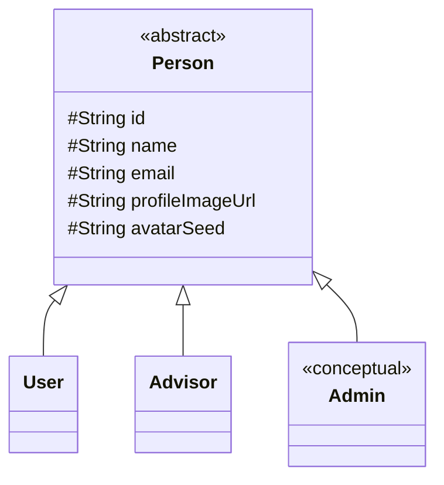
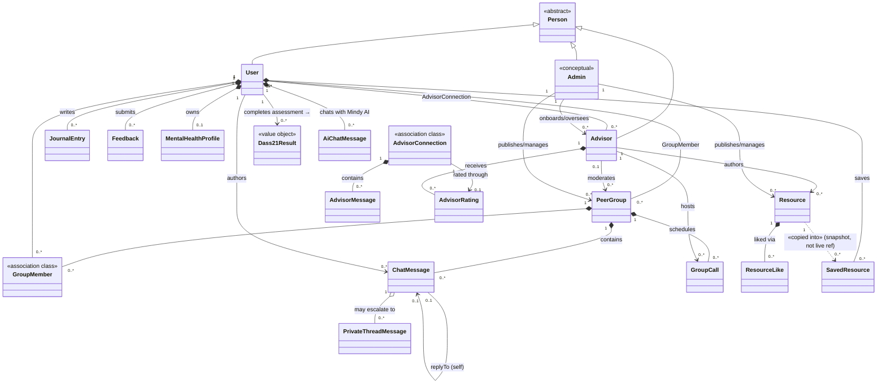

# MindMatesPlus — Class Diagram Reference

This file translates the MindMatesPlus domain model — as implemented in `src/types.ts`,
`src/services/dataService.ts`, `src/context/AppContext.tsx` and the Firestore security
rules (`firestore.rules`) — into **UML class-diagram shape**: classes, attributes,
operations, generalizations, associations, aggregations, compositions and
multiplicities. Drop the Mermaid blocks straight into [mermaid.live](https://mermaid.live),
draw.io, Lucidchart, StarUML, or PlantUML (the structure maps 1:1) and use the
detailed tables in §6 to fill in attributes/operations by hand.

> Companion file: [`FIRESTORE_ER_DIAGRAM_GUIDE.md`](FIRESTORE_ER_DIAGRAM_GUIDE.md) maps
> the same model into an **ER diagram** (data perspective). This file maps it into a
> **class diagram** (object-oriented design perspective) — same entities, different lens:
> ER asks "how is this stored?", class diagram asks "what does this object know and do?".

---

## 1. Modeling Conventions Used Below

MindMatesPlus is a React Native + Firebase app written in a functional/hooks style —
there are no hand-written `class Foo {}` definitions. To produce a class diagram you
therefore translate the existing shapes as follows:

| Codebase concept | Class-diagram equivalent | Notes |
|---|---|---|
| `interface User`, `interface Advisor`, … (`src/types.ts`) | **Class** with attributes | TS `interface` → UML class; optional fields (`age?`) → attributes with `[0..1]` multiplicity |
| Functions in `dataService.ts` / `AppContext.tsx` that read/write a given entity | **Operations (methods)** of that class | e.g. `joinPeerGroup(userId, groupId)` becomes `User::joinGroup(groupId)` — group the free functions by the entity they primarily act on |
| A field that stores another entity's document ID (`advisorId`, `authorId`, `senderId`, …) | **Association** (often unidirectional) | becomes a navigable reference / role name in the class diagram |
| A `map`/embedded object field (`analysis`, `initialQuestionnaireScore`, `mlAnalysis`, …) | **Composition to a Value Object** | the child has no identity outside its parent — draw with a filled diamond |
| A subcollection (`users/{id}/journal_entries`) | **Composition (1 → \*)** | child is destroyed conceptually with the parent |
| A flat "junction" collection (`groupMembers`, `advisorConnections`) | **Association class / many-to-many** | can be drawn as an associative entity between the two classes it connects |
| A union/string-literal type (`'low' \| 'moderate' \| 'severe'`) | **Enumeration** | give it its own `<<enumeration>>` class |
| Three different "kinds of person" (member, advisor, system operator) | **Generalization hierarchy** | see §3 — `Person` as an abstract superclass of `User`, `Advisor`, `Admin` |

---

## 2. Class Catalogue

| # | Class | Stereotype | Defined / inferred from | Package |
|---|---|---|---|---|
| 1 | **Person** | `<<abstract>>` | *suggested superclass — not literally in code, see §3* | Identity & Roles |
| 2 | **User** | `<<entity>>` | `types.ts: User`, `users/{userId}` | Identity & Roles |
| 3 | **Advisor** | `<<entity>>` | `types.ts: Advisor`, `advisors/{advisorId}` | Identity & Roles |
| 4 | **Admin** | `<<entity>> <<conceptual>>` | inferred — `firestore.rules` "advisor/admin SDK"; not implemented in this repo | Identity & Roles |
| 5 | PeerGroup (`Group`) | `<<entity>>` | `types.ts: Group`, `peer_groups/{groupId}` | Peer Support |
| 6 | GroupMember | `<<association class>>` | `groupMembers/{groupId}_{userId}` | Peer Support |
| 7 | GroupMembership | `<<entity>>` | `users/{userId}/group_memberships/{groupId}` (per-user mirror of #6) | Peer Support |
| 8 | ChatMessage / Message | `<<entity>>` | `types.ts: Message`, `peer_groups/{groupId}/chatMessages/{msgId}` | Peer Support |
| 9 | PrivateThreadMessage | `<<entity>>` | `types.ts: PrivateThreadMessage` | Peer Support |
| 10 | GroupCall | `<<entity>>` | `peer_groups/{groupId}/groupCalls/{callId}`, `groupCallService.ts` | Peer Support |
| 11 | ChatReadState | `<<entity>>` | `users/{userId}/chatReadState/{chatId}` | Peer Support |
| 12 | AdvisorConnection | `<<association class>>` | `dataService.ts: AdvisorConnection`, `advisorConnections/{connectionId}` | Advisor Care |
| 13 | AdvisorMessage | `<<entity>>` | `dataService.ts: AdvisorMessage` | Advisor Care |
| 14 | AdvisorRating | `<<entity>>` | `advisors/{advisorId}/ratings/{ratingId}` | Advisor Care |
| 15 | ListenerConnection | `<<DTO / view>>` | `dataService.ts: ListenerConnection` — UI projection of #12 for the Listener tab | Advisor Care |
| 16 | JournalEntry | `<<entity>>` | `types.ts: JournalEntry` | Personal Wellness |
| 17 | Feedback | `<<entity>>` | `types.ts: Feedback` | Personal Wellness |
| 18 | MentalHealthProfile | `<<entity>>` | `dataService.ts: MentalHealthProfile`, `users/{id}/mentalHealthProfile/currentProfile` | Personal Wellness |
| 19 | RecommendationState | `<<entity>>` | `types.ts: KnnRecommendationState`, `users/{id}/mentalHealth/recommendationState` | Personal Wellness |
| 20 | WellnessScoreHistory | `<<entity>>` | `users/{id}/wellnessScoreHistory/{docId}` | Personal Wellness |
| 21 | Dass21Result | `<<value object>>` | `types.ts: Dass21Result` (+ `Dass21SubscaleResult`) | Personal Wellness |
| 22 | Resource | `<<entity>>` | `types.ts: Resource`, `resources/{resourceId}` | Content |
| 23 | ResourceLike | `<<entity>>` | `resources/{resourceId}/likes/{userId}` | Content |
| 24 | SavedResource | `<<entity>>` | `users/{userId}/savedResources/{resourceId}` | Content |
| 25 | AiChatMessage | `<<entity>>` | `users/{userId}/aiChatMessages/{docId}` | AI Companion |
| 26 | MlAnalysis / MlAnalysisHistory | `<<entity>>` | `users/{userId}/ml_analysis`, `…/mlAnalysisHistory` | Analytics / ML |
| 27 | MlMentalHealthProfile | `<<value object>>` | `types.ts: MlMentalHealthProfile` (embedded on `User`) | Analytics / ML |
| 28 | QuestionnaireScore / MlEmotionScore / MlStabilityCounter / WeeklyEmotionSummary | `<<value object>>` | embedded maps inside `MentalHealthProfile` | Analytics / ML |
| 29 | KnnInput | `<<DTO>>` | `types.ts: KnnInput` — request payload to `POST /recommend-groups` | Analytics / ML |

**Bolded** rows (1–4) are the actor classes most diagrams should anchor on, mirroring
the "hub" entities `User`, `PeerGroup`, `Advisor` from the ER guide, plus the new
`Admin` / `Person` actors this file adds.

---

## 3. Actor / Role Hierarchy — `Person`, `User`, `Advisor`, `Admin`

The Firestore schema stores users and advisors in **completely separate root
collections** (`users/{uid}` vs `advisors/{uid}`) with no shared parent — there is no
literal `Person` table. For an OOP **class diagram**, however, it's idiomatic (and
expected by most rubrics) to factor their shared identity attributes into an abstract
superclass and model the three roles as a generalization set:

* **`User`** — the support-seeking member; the primary actor of *this* app
  (`MindMatesPlus-User`). Registers via Firebase Auth email/password
  (`AppContext.register`); profile lives at `users/{uid}`.
* **`Advisor`** — a counsellor / peer-support professional. Manages their own profile
  from a separate **Advisor App** (`firestore.rules`: *"Advisors write their own
  profile from the Advisor App"*); profile lives at `advisors/{uid}`. Functionally the
  app already routes Advisors into two **case types** — `listener_support` (general,
  unrestricted chat) vs `critical_case` (safety-flagged, access-restricting) — see
  `requestExpertListener()`. If your rubric wants a deeper hierarchy you can model
  these as `Listener` / `CrisisCounsellor` subclasses of `Advisor`; in the current
  schema, though, it's routing/state on `AdvisorConnection.caseType`, not a separate
  collection, so a flat `Advisor` class is the more accurate baseline.
* **`Admin`** — the system operator (content moderation, advisor onboarding, group &
  resource publishing, analytics oversight). **Not implemented in this repository** —
  `firestore.rules` repeatedly notes that certain writes ("Writes come from the
  advisor/admin SDK", "advisor/admin SDK only") originate from a privileged backend/
  portal this app never touches. It is included here, marked `<<conceptual>>`, purely
  so the class diagram represents the *whole* MindMatesPlus system rather than just
  this client. Document it on your diagram with a note such as *"realised by a separate
  Admin Portal / Cloud Functions service account — not present in the User app codebase"*.

> If your rubric prefers **independent classes with no shared base** (closer to the
> literal schema), simply delete `Person` and copy its five attributes into `User`,
> `Advisor`, and `Admin` directly — every relationship in §7 still holds.

---

## 4. High-Level Class Diagram (Mermaid)

A starting skeleton for the "hub" classes and their cardinalities — paste into
[mermaid.live](https://mermaid.live), then enrich each box using §6's attribute/operation
tables.

Legend: `*--` composition (child's lifecycle owned by parent / subcollection),
`o--` aggregation (conditional / weaker ownership — e.g. a private thread only exists
*if* a message was escalated), `-->` navigable association, `..>` dependency
(derives-from / one-time copy, not a live link), `<|--` generalization,
`"m" -- "n"` plain association with multiplicities.

---

## 5. Relationship & Multiplicity Reference

| From | Relationship | To | Multiplicity | UML kind | Notes |
|---|---|---|---|---|---|
| Person | generalizes | User, Advisor, Admin | 1 → {1} | Generalization | shared identity attributes (§3) |
| User | writes | JournalEntry | 1 → 0..* | Composition | subcollection — owned & deleted with user |
| User | submits | Feedback | 1 → 0..* | Composition | subcollection |
| User | owns | MentalHealthProfile | 1 → 0..1 | Composition | single-document subcollection (1:1) |
| User | owns | RecommendationState | 1 → 0..1 | Composition | single-document subcollection (1:1), KNN-pipeline-owned |
| User | completes | Dass21Result | 1 → 0..* | Dependency | transient assessment result; seeds AI chat & baseline category |
| User | sends | AiChatMessage | 1 → 0..* | Composition | subcollection |
| User | saves | SavedResource | 1 → 0..* | Composition | denormalized snapshot copy of a `Resource` |
| User | likes | ResourceLike | 1 → 0..* | Association | doc id == `userId`, one like per resource |
| User ⟷ PeerGroup | joins / has members | GroupMember (assoc. class) | 0..* ⟷ 0..* | Association class (M:N) | mirrored by per-user `GroupMembership`; deterministic id `{groupId}_{userId}` |
| User ⟷ Advisor | requests / is requested by | AdvisorConnection (assoc. class) | 0..* ⟷ 0..* | Association class (M:N) | rich relationship state (status, caseType) — not a thin join |
| User | authors | ChatMessage, AiChatMessage, AdvisorMessage, PrivateThreadMessage | 1 → 0..* | Association | via `senderId` / `authorId` |
| User | rates | AdvisorRating | 1 → 0..1 (per connection) | Association | compound id `{userId}_{connectionId}` enforces ≤ 1 rating per connection |
| PeerGroup | contains | ChatMessage | 1 → 0..* | Composition | subcollection |
| PeerGroup | schedules | GroupCall | 1 → 0..* | Composition | subcollection |
| ChatMessage | may escalate to | PrivateThreadMessage | 1 → 0..* | Aggregation (conditional) | only when `hasPrivateThread == true`; gated by advisor action |
| ChatMessage | replies to / responds to | ChatMessage (self) | 0..1 → 1 | Association (reflexive) | `replyTo.id`, `inResponseToDistressedMsgId` |
| Advisor | receives | AdvisorRating | 1 → 0..* | Composition | subcollection; aggregated into `averageRating` |
| Advisor | hosts | GroupCall | 1 → 0..* | Association | `GroupCall.advisorId` |
| Advisor | moderates | PeerGroup | 0..1 → 0..* | Association (loose) | resolved client-side **by name**, not ID — not a true FK |
| Advisor | authors | Resource | 1 → 0..* | Association | `Resource.authorId == Advisor.uid`, convention-only FK |
| AdvisorConnection | contains | AdvisorMessage | 1 → 0..* | Composition | subcollection |
| AdvisorConnection | rated through | AdvisorRating | 1 → 0..1 | Association | at most one rating per connection |
| Resource | liked via | ResourceLike | 1 → 0..* | Composition | subcollection, doc id == `userId` |
| Resource | copied into | SavedResource | 1 ┄> 0..* | Dependency (snapshot) | one-time denormalized copy — edits to `Resource` do **not** propagate |
| MentalHealthProfile | embeds | QuestionnaireScore, MlEmotionScore, WeeklyEmotionSummary, MlStabilityCounter | 1 ◆ 0..1 | Composition (value object) | maps with no independent identity |
| Admin | publishes / manages | PeerGroup, Resource | 1 → 0..* | Association `<<conceptual>>` | "advisor/admin SDK only" per `firestore.rules` — write path lives outside this repo |
| Admin | onboards / oversees | Advisor | 1 → 0..* | Association `<<conceptual>>` | inferred system responsibility, not directly observable in this codebase |

> The User ↔ PeerGroup and User ↔ Advisor many-to-many relationships are each backed
> by **two** Firestore structures for query-direction reasons (`GroupMember` +
> `GroupMembership`; `AdvisorConnection` mirrored into `MentalHealthProfile` fields).
> On an OOP class diagram these collapse cleanly into a **single association class**
> each — that's the recommended simplification (see §4.18 / §4.21 of the ER guide for
> the full Firestore-side rationale).

---

## 6. Detailed Class Reference (Attributes + Operations)

Attribute types follow `src/types.ts`; `?` marks optional (`[0..1]`) attributes.
Operations are **derived by grouping the relevant `dataService.ts` / `AppContext.tsx`
functions by the entity they act on** — group/rename them as you like, they're meant
as a checklist, not a literal method table (this codebase has no real classes).
`(advisor app)` / `(admin portal)` tags mark operations this repo only *consumes the
result of* — the operation itself is implemented in another codebase.

### 6.1 `Person` «abstract»
| Attribute | Type |
|---|---|
| id | String |
| name | String |
| email | String |
| profileImageUrl | String? |
| avatarSeed | String? |

### 6.2 `User`
| Attribute | Type | Notes |
|---|---|---|
| nickname | String? | shown in UI in place of `name` |
| age | Number? | derived from `dob` at signup |
| riskLevel | `'low'\|'moderate'\|'severe'`? | secondary signal alongside `MentalHealthProfile` |
| supportScore | Number? | gamification points |
| earnedBadges | String[]? | badge-ID array |
| mlMentalHealthProfile | MlMentalHealthProfile? | embedded value object, §6.27 |
| createdAt | Date | |

**Operations:** `register(email, password, name)` · `login(email, password)` ·
`logout()` · `updateProfile(fields)` · `uploadProfileImage(uri)` ·
`addJournalEntry(title, content, mood, mlAnalysis?)` · `removeJournalEntry(entryId)` ·
`submitFeedback(rating, peerComment, appComment)` ·
`joinGroup(groupId)` / `leaveGroup(groupId)` · `markGroupAsVisited(groupId)` ·
`sendGroupMessage(groupId, text, replyTo?)` · `sendAiMessage(text)` ·
`requestAdvisorConnection(advisorId)` (→ `requestExpertListener`) ·
`rateAdvisor(advisorId, connectionId, rating, comment)` (→ `submitAdvisorRating`) ·
`toggleResourceLike(resourceId)` · `toggleResourceSave(resource)` ·
`completeDass21Assessment(answers)` (→ `computeDass21Result`) ·
`markChatRead(groupId)`

### 6.3 `Advisor`
| Attribute | Type | Notes |
|---|---|---|
| specialty | String | |
| availability | String | `online\|busy\|away\|offline` |
| rating / averageRating | Number? | computed aggregate |
| ratingSum, ratingCount | Number | running totals (transactional) |
| experience | String? | |
| sessions | String? | |
| about | String? | |

**Operations** *(advisor app — referenced by this app's read-only fields/UI but
implemented in the separate Advisor App)*: `updateProfile(fields)` ·
`reviewFlaggedMessage(messageId, decision: approved\|rejected)` ·
`deleteMessage(messageId)` · `openPrivateThread(messageId)` ·
`replyToPrivateThread(messageId, text)` · `approveUserCategory(userId, category)` ·
`respondToConnection(connectionId, decision)` · `sendAdvisorMessage(connectionId, text)` ·
`hostGroupCall(groupId, title, roomUrl)` · `publishResource(resource)` ·
`moderateGroup(groupId)`

### 6.4 `Admin` «conceptual»
| Attribute | Type | Notes |
|---|---|---|
| permissions / role | String[] | inferred — not modeled in this codebase |
| managedDomains | String[]? | e.g. `advisors`, `peer_groups`, `resources` |

**Operations** *(admin portal — wholly external to this repo; included for system
completeness)*: `createPeerGroup(details)` · `editPeerGroup(groupId, details)` ·
`onboardAdvisor(details)` · `deactivateAdvisor(advisorId)` · `publishResource(resource)` ·
`removeResource(resourceId)` · `viewSystemAnalytics()` · `assignGroupModerator(groupId, advisorId)`

### 6.5 `PeerGroup` (`Group`)
| Attribute | Type | Notes |
|---|---|---|
| id | String | |
| name | String | aliases: `group_name` (legacy) |
| description | String | |
| category | GroupCategory «enum» | |
| members / memberCount | Number | |
| image / imageUrl | String? | |
| moderatorName | String? | resolved client-side against `Advisor.name` |
| moderatorImageUrl | String? | |
| moderatorAvailability | String? | |
| isActive | Boolean | |

**Operations:** `fetchPeerGroups()` · `getRecommendedGroups(category)` ·
`fetchRecommendedGroups(category)` — read/query operations exposed via `dataService`;
writes are `<<conceptual>>` (Admin/Advisor SDK only, per `firestore.rules`).

### 6.6 `GroupMember` «association class» (User ⟷ PeerGroup)
| Attribute | Type | Notes |
|---|---|---|
| id | String | deterministic `{groupId}_{userId}` |
| groupId | String | → PeerGroup |
| userId | String | → User |
| joinedAt | Date | |

**Operations:** `joinPeerGroup(userId, groupId)` · `leavePeerGroup(userId, groupId)` ·
`fetchUserJoinedGroupIds(userId)`

### 6.7 `GroupMembership`
Per-user mirror of `GroupMember`, PK = `groupId`, fields `{group_id, joined_at, status}`.
Consider folding into `GroupMember` on your diagram — see the note at the end of §5.

### 6.8 `ChatMessage` / `Message`
| Attribute | Type | Notes |
|---|---|---|
| id | String | |
| text | String \| EncryptedMessage | AES-encrypted at rest, plaintext fallback |
| sender | `'user'\|'ai'\|'peer'` | |
| senderId, senderName, senderAvatarSeed | String? | |
| timestamp | Date | |
| flagged | Boolean? | crisis-keyword detection |
| reviewStatus | ReviewStatus «enum»? | absent on AI-chat messages |
| reviewedBy, reviewedAt | String/Date? | **written by Advisor app** |
| deletedByAdvisor | Boolean? | **written by Advisor app** (soft delete) |
| hasPrivateThread | Boolean? | **written by Advisor app** |
| bertPrediction | `{label, confidence}`? | written back by async ML pipeline |
| replyTo | `{id, text, senderName, senderId?}`? | self-reference |
| inResponseToDistressedMsgId | String? | self-reference (supportive-reply detection) |

**Operations:** `saveChatMessage(groupId, senderId, senderName, text, avatarSeed, replyTo?)` ·
`subscribeGroupMessages(groupId, cb)` · `deleteGroupMessage(groupId, msgId)` ·
`markChatRead(userId, groupId)`

### 6.9 `PrivateThreadMessage`
| Attribute | Type | Notes |
|---|---|---|
| id, text, timestamp | String/String\|EncryptedMessage/Date | |
| senderId, senderName, senderRole (`user\|advisor`) | String | |
| receiverId, receiverName | String | |
| isPrivate | Boolean | always `true` |
| threadType | `'advisor_private_message'\|'user_private_reply'` | |
| flaggedMessageRef | String | → ChatMessage |
| visibleTo | String[] | exactly `[advisorId, userId]` |

**Operations:** `subscribePrivateThread(groupId, msgId, cb)` ·
`sendPrivateThreadReply(groupId, msgId, senderId, text)`

### 6.10 `GroupCall`
| Attribute | Type | Notes |
|---|---|---|
| id, groupId, advisorId | String | |
| advisorName, title, roomUrl | String | |
| status | `'live'\|'scheduled'\|'ended'` «enum» | |
| scheduledAt, startedAt, endedAt | Date? | |
| createdAt | Date | |

**Operations** (`groupCallService.ts`): `joinGroupCall(callId)` · `leaveGroupCall(callId)` ·
`subscribeUpcomingCalls(groupId, cb)` · `subscribeLiveCall(groupId, cb)`

### 6.11 `ChatReadState`
PK = `chatId` (a `groupId`); fields `{lastReadAt, chatId, type:"group"}`.
**Operations:** `markChatRead(userId, groupId)` · `getLastReadAt(userId, groupId)` ·
`subscribeUnreadCount(userId, groupId, cb)`

### 6.12 `AdvisorConnection` «association class» (User ⟷ Advisor)
| Attribute | Type | Notes |
|---|---|---|
| connectionId | String | |
| userId, userName, userEmail, userNickname | String | |
| advisorId, advisorName | String | |
| status | `'pending'\|'accepted'\|'approved'\|'reviewed'\|'closed'` «enum» | |
| caseType | `'critical_case'\|'listener_support'` «enum» | |
| source | String? | e.g. `listener_expert` |
| reason | String | |
| userMentalHealthCategory | String | snapshot at request time |
| createdAt, updatedAt | Date | |
| lastMessage, lastMessageAt, lastMessageSenderId | String/Date/String? | preview metadata |
| userLastReadAt | Date? | doubles as the *advisor-chat* read marker |
| userRated | Boolean? | guards duplicate rating prompts |

**Operations:** `requestExpertListener(params)` (= `connectToAdvisor`) ·
`findAdvisorConnection(userId, advisorId)` · `checkExistingAdvisorConnection(...)` ·
`updateUserAdvisorStatus(connectionId, status)` ·
`listenToUserAdvisorConnections/listenToAdvisorConnectionsWithNames(userId, cb)` ·
`listenToUserListenerConnections(userId, cb)`

### 6.13 `AdvisorMessage`
| Attribute | Type | Notes |
|---|---|---|
| id, senderId, receiverId | String | |
| senderRole | `'user'\|'advisor'` | |
| messageText | String \| EncryptedMessage | user→advisor encrypted; advisor→user plaintext (see ER guide §4.22 ⚠) |
| messageType | String | constant `text` |
| createdAt | Date | |
| isRead | Boolean | |

**Operations:** `sendUserAdvisorMessage(connectionId, text)` ·
`sendAdvisorUserMessage(connectionId, text)` *(advisor app)* ·
`listenToAdvisorConnectionMessages(connectionId, cb)` ·
`updateAdvisorConnectionLastMessage(connectionId, preview)`

### 6.14 `AdvisorRating`
| Attribute | Type | Notes |
|---|---|---|
| id | String | deterministic `{userId}_{connectionId}` |
| userId, userNickname | String | |
| advisorId, connectionId | String | |
| rating | Number | 1–5 |
| comment | String? | |
| createdAt | Date | |

**Operations:** `submitAdvisorRating(params)` · `hasUserRatedAdvisor(userId, advisorId, connectionId)`

### 6.15 `ListenerConnection` «DTO»
UI-side projection of `AdvisorConnection` filtered to `caseType == 'listener_support'`:
`{id, advisorId, advisorName?, userMentalHealthCategory?, status, createdAt, acceptedAt?}`.
Exists purely so `ListenerScreen`/`ExpertListView` can render without re-deriving from
the full connection shape — you can omit it from the diagram or draw it as a thin
`<<view>>` of `AdvisorConnection`.

### 6.16 `JournalEntry`
| Attribute | Type |
|---|---|
| id, title, content, mood | String |
| timestamp | Date |
| analysis | `{sentiment, emotion, risk, score}`? «value object» |
| mlAnalysis | `{prediction, confidence, probabilities}`? «value object» |

**Operations:** `addJournalEntry(...)` · `removeJournalEntry(entryId)` ·
`fetchJournalEntries(userId)` · `fetchUserJournalTexts(userId)`

### 6.17 `Feedback`
`{id, rating: Number, peerComment, appComment: String, date: Date}`.
**Operations:** `submitFeedback(rating, peerComment, appComment)` · `saveFeedback(userId, feedback)`

### 6.18 `MentalHealthProfile`
The central state machine — written by **this app**, the **Advisor app**, and a
**backend ML/KNN pipeline**. The richest class in the system; consider showing only
its key attributes on the main diagram and detailing the rest in a note/appendix.

| Attribute | Type | Notes |
|---|---|---|
| initialQuestionnaireScore | QuestionnaireScore «value object» | immutable DASS-21 baseline |
| latestMlEmotionScore | MlEmotionScore? «value object» | latest BERT snapshot |
| baselineRecommendationCategory, activeRecommendationCategory | GroupCategory «enum» | |
| peerGroupRecommendationCategory, resourceRecommendationCategory, dashboardCategory | GroupCategory? | |
| recommendationSource | `'questionnaire'\|'ml_analysis'\|'advisor_approval'\|'safety_restriction'` «enum» | |
| userStatus | `'normal'\|'under_review'\|'restricted'` «enum» | |
| mlStabilityCounter, resourceStabilityCounter | MlStabilityCounter? «value object» | |
| weeklyTrendSummary | WeeklyTrendSummary? «value object» | |
| wellnessScore | Number? | 0–100 |
| connectedAdvisorId | String? | → Advisor |
| advisorConnectionId | String? | → AdvisorConnection |
| approvedCategory, approvedByAdvisorId | GroupCategory? / String? | **set by Advisor app** |
| knnRecommendedGroup, knnMappedCategory, knnProbabilities, knnSafetyFlag | mixed | KNN pipeline output |
| restrictedReason, restrictedAt | String?/Date? | |

**Operations:** `fetchMentalHealthProfile(userId)` · `listenToMentalHealthProfile(userId, cb)` ·
`updateMentalHealthProfileFromMl(...)` · `updateQuestionnaireBaseline(...)` ·
`updateCategoryWithStabilityRules(...)` · `isUserRestricted(profile)` ·
`applyLowWellnessRestriction(...)` · `continueAfterAdvisorApproval(userId)` ·
`callKnnAndWriteResult(userId)` · `runWeeklyKnnRecommendation(userId)`

### 6.19 `RecommendationState`
`{peerGroupRecommendationCategory, dashboardCategory, recommendationEngine:"knn", lastWeeklyAnalysisAt, weeklyTrendSummary}`
— deliberately separate from `MentalHealthProfile` ("BERT pipeline owns
`currentProfile`, KNN pipeline owns `recommendationState`"). Owned 1:1 by `User`.

### 6.20 `WellnessScoreHistory`
`{previousScore, newScore, changeAmount: Number, source, textPreview, mlPrediction: String, mlConfidence: Number, createdAt: Date}`.
**Operations:** `saveWellnessScoreHistory(...)` · `updateWellnessScoreGradually(...)` ·
`calculateScoreAdjustment(...)` · `calculateWellnessScore(category)`

### 6.21 `Dass21Result` «value object»  *(+ `Dass21SubscaleResult`)*
| Attribute | Type |
|---|---|
| answers | Record<Number, Number> |
| depression, anxiety, stress | Dass21SubscaleResult `{raw, final, severity, severityColor}` |
| group | 1\|2\|3\|4\|5 |
| groupCategory | GroupCategory «enum» |
| riskLevel | `'low'\|'moderate'\|'severe'` «enum» |
| message, ctaLabel, ctaVariant, reassessInDays | mixed |

**Operations:** `computeDass21Result(answers)` · `prepareSupportChatFromDass(result)`

### 6.22 `Resource`
| Attribute | Type | Notes |
|---|---|---|
| id, title | String | |
| description | String? | |
| category | String (GroupCategory-ish) | |
| contentType | `'text'\|'image'` | |
| imageUrl, textContent | String? | |
| isActive | Boolean? | |
| postedBy, authorId, posterImageUrl, authorInitials | String? | `authorId` → Advisor |

**Operations:** `fetchResources(category?)` · `fetchResourcesByCategory(...)` ·
`fetchRecommendedResources(category)` — writes are `<<conceptual>>` (Advisor/Admin SDK only)

### 6.23 `ResourceLike`
PK = `userId`; `{userId: String, createdAt: Date}`.
**Operations:** `toggleResourceLike(resourceId, userId)` · `listenToResourceInteractions(...)`

### 6.24 `SavedResource`
Denormalized snapshot copy of a `Resource` at save time (`title, description, category,
contentType, imageUrl, textContent, postedBy, posterImageUrl, authorId, createdAt,
savedAt`). **Operations:** `toggleResourceSave(userId, resource)` ·
`listenToResourceSaveState(...)` · `listenToUserSavedResources(userId, cb)`

### 6.25 `AiChatMessage`
`{text: String|EncryptedMessage, timestamp: Date, sender: 'user'|'ai'}`.
**Operations:** `saveAiChatMessage(userId, text)` · `sendAiMessage(text)` ·
`runMlAnalysisForText(userId, text, source)`

### 6.26 `MlAnalysis` / `MlAnalysisHistory`
Source-tagged ML predictions: `{source_type/source: 'journal'|'chat'|'group_chat'|
'ai_chat'|'feedback', emotion_detected/prediction, confidence_score/confidence,
probabilities{depression,anxiety,normal}, textPreview, resourceRecommendationCategory,
created_at/createdAt}`. **Operations:** `addMlAnalysis(...)` ·
`saveMlAnalysisHistory(...)` · `calculateWeeklyMlTrend(userId)` ·
`getWeeklyDominantEmotion(userId)`

### 6.27 `MlMentalHealthProfile` «value object» (embedded on `User`)
`{latestPrediction: String, latestConfidence: Number, dominantCategory: String,
depressionCount, anxietyCount, normalCount: Number, lastUpdated: Date}`.
**Operations:** `updateMlMentalHealthProfile(userId, entries)`

### 6.28 Embedded value objects on `MentalHealthProfile`
* **`QuestionnaireScore`** — `{depressionScore, anxietyScore, stressScore, totalScore: Number, mainCondition, category: String, completedAt: Date}`
* **`MlEmotionScore`** — `{prediction: String, confidence: Number, probabilities{...}, recordedAt, analyzedAt?: Date, sourceTextsUsed?: String[]}`
* **`MlStabilityCounter`** — `{lastPrediction: String, repeatedCount: Number, lastUpdatedAt: Date}`
* **`WeeklyEmotionSummary`** — `{dominantEmotion: String, averageConfidence: Number, totalRecords: Number, emotionDistribution{depression,anxiety,normal}}`

### 6.29 `KnnInput` «DTO»
5-feature payload to the recommender backend `POST /recommend-groups`:
`{depression_score, anxiety_score, stress_score: Number(0–42), dominant_emotion: String, emotion_confidence: Number(0–1)}`.
**Operations:** `buildKnnInput(profile, weeklySummary)`

---

## 7. Enumerations / Controlled Vocabularies

Model each as its own `<<enumeration>>` class (Mermaid: `class X { <<enumeration>> A B C }`):

| Enumeration | Values | Used by |
|---|---|---|
| `GroupCategory` | `Severe Support · Moderate Support · Mild Support · Wellness - Thriving · Wellness - Stress Aware · Wellness - Emotionally Aware · Recovery & Improvement` | `PeerGroup.category`, many `MentalHealthProfile` fields, `Resource.category` |
| `RiskLevel` | `low \| moderate \| severe` | `User.riskLevel`, `Dass21Result.riskLevel` |
| `ReviewStatus` | `pending \| approved \| rejected \| not_required` | `ChatMessage.reviewStatus` |
| `UserStatus` | `normal \| under_review \| restricted` | `MentalHealthProfile.userStatus` |
| `RecommendationSource` | `questionnaire \| ml_analysis \| advisor_approval \| safety_restriction` | `MentalHealthProfile.recommendationSource` |
| `ConnectionStatus` | `pending \| accepted \| approved \| reviewed \| closed` | `AdvisorConnection.status` |
| `CaseType` | `critical_case \| listener_support` | `AdvisorConnection.caseType` |
| `CallStatus` | `live \| scheduled \| ended` | `GroupCall.status` |
| `SenderRole` | `user \| ai \| peer` (chat) / `user \| advisor` (advisor threads) | `Message.sender`, `PrivateThreadMessage.senderRole`, `AdvisorMessage.senderRole` |
| `ContentType` | `text \| image` | `Resource.contentType` |
| `MlPredictionLabel` | `depression \| anxiety \| normal` | BERT outputs across `MlAnalysis`, `MlEmotionScore`, `WeeklyEmotionSummary`, … |
| `Availability` | `online \| busy \| away \| offline` | `Advisor.availability` |
| `ThreadType` | `advisor_private_message \| user_private_reply` | `PrivateThreadMessage.threadType` |

---

## 8. Suggested Package / Layout Grouping

To keep the diagram readable, cluster classes into UML packages and lay them out
left-to-right in this order (matches the groupings in §2 & §6):

1. **Identity & Roles** — `Person`, `User`, `Advisor`, `Admin` (anchor top-left; the
   generalization triangle reads cleanest vertically)
2. **Peer Support** — `PeerGroup`, `GroupMember`, `ChatMessage`, `PrivateThreadMessage`,
   `GroupCall`, `ChatReadState`
3. **Advisor Care** — `AdvisorConnection`, `AdvisorMessage`, `AdvisorRating`,
   `ListenerConnection`
4. **Personal Wellness** — `JournalEntry`, `Feedback`, `MentalHealthProfile` (+ its
   embedded value objects), `RecommendationState`, `WellnessScoreHistory`, `Dass21Result`
5. **Content** — `Resource`, `ResourceLike`, `SavedResource`
6. **AI Companion / Analytics** — `AiChatMessage`, `MlAnalysis`, `MlAnalysisHistory`,
   `MlMentalHealthProfile`, `KnnInput`

`User` and `Advisor` are the two classes with edges into nearly every package — place
them centrally so association lines don't have to cross the whole canvas.

---

## 9. Cross-Cutting Notes Worth Capturing on the Diagram

1. **This repo is the *User* app only.** `Advisor` and `Admin` participate in the
   system-wide class diagram but are largely realised by sibling codebases (an
   "Advisor App" referenced directly in `firestore.rules`, and an unnamed
   "advisor/admin SDK" / portal for privileged writes to `peer_groups`, `resources`,
   and moderation fields). Mark cross-app boundaries explicitly — e.g. a dashed
   package boundary or a `<<remote>>` stereotype — so reviewers understand which
   classes are implemented where.
2. **Encryption as a cross-cutting concern**: `ChatMessage.text`, `AiChatMessage.text`,
   `PrivateThreadMessage.text`, and user-authored `AdvisorMessage.messageText` are
   `String | EncryptedMessage` (`{ciphertext, iv, v}`). You can model `EncryptedMessage`
   as a small value object, or simply annotate the attribute type as shown.
3. **Value objects vs. entities**: anything embedded as a `map` on a parent document
   (`analysis`, `mlAnalysis`, `initialQuestionnaireScore`, `weeklyTrendSummary`,
   `bertPrediction`, `replyTo`, …) has **no identity of its own** — model it as a
   composed value object (filled diamond), not a class with its own lifecycle/PK.
4. **Denormalization**: `SavedResource` is a frozen *copy* of `Resource` fields at
   save-time (dependency `<<copy>>`, not a live association) — and `GroupMember` /
   `GroupMembership` are two physical mirrors of one logical M:N relationship. Both
   collapse to a single relationship on an OOP diagram; note the duplication only as
   an implementation comment if your rubric asks for fidelity to the codebase.
5. **Self-referencing associations**: `ChatMessage.replyTo` and
   `ChatMessage.inResponseToDistressedMsgId` are reflexive associations on the same
   class — draw the relationship line looping back to `ChatMessage` itself.
6. **Inconsistent legacy naming** (`group_name` vs `name`, `resource_category` vs
   `category`, …, see ER guide §4.14/§4.23/§4) — pick **one** canonical attribute
   name per concept for the class diagram; you don't need to reproduce every alias.
