# MindMatesPlus — Firestore ER Diagram Reference

Firestore is a NoSQL **document database** — it has no native tables, foreign keys, or
joins. To draw an ER diagram you treat each **collection / subcollection** as an
*entity*, each **document field** as an *attribute*, and each **string field that
stores another document's ID** as a *foreign key / relationship*. This file maps the
live schema (as implemented in `src/services/dataService.ts`, `src/types.ts`,
`firestore.rules`, and related screens/services) into that relational shape so you can
drop it straight into draw.io, Lucidchart, dbdiagram.io, or the Mermaid editor.

> Source of truth: this file was generated by reading the actual Firestore calls in the
> codebase (paths passed to `collection(db, …)` / `doc(db, …)`), not just the TS
> interfaces — so it also captures fields that are written by external systems
> (advisor portal / backend pipelines) that this app only *reads*.

---

## 1. Firestore → ER Mapping Conventions Used Below

| Firestore concept | ER equivalent | Notes |
|---|---|---|
| Root collection (`users`, `peer_groups`, …) | Strong entity | Has its own document ID as PK |
| Subcollection (`users/{id}/journal_entries`) | Weak entity | PK = parent PK + own doc ID (composite) |
| "Single-document" subcollection (`mentalHealthProfile/currentProfile`) | 1:1 entity | Always exactly one doc with a fixed ID — model as a 1‑to‑1 relation, or fold into the parent entity |
| String field holding another doc's ID (`advisorId`, `userId`, `resourceId`, …) | Foreign key | Firestore doesn't enforce these — they're convention-only |
| `map` field (e.g. `initialQuestionnaireScore`, `bertPrediction`) | Embedded value object / composite attribute | Not its own entity; shown inline or as a sub-table |
| Flat collection used purely to join two entities (`groupMembers`, `advisorConnections`) | Associative / junction entity (M:N) | Usually has a deterministic compound ID |
| `serverTimestamp()` / `Timestamp.now()` | `datetime` attribute | |
| Encrypted text fields (`text`, `messageText`) | `string` attribute, semantically `ciphertext` | Stored as `{ciphertext, iv, v}` map OR plaintext string fallback — see §7 |

---

## 2. Entity Catalogue

| # | Entity (suggested ER name) | Firestore path | Category | Primary Key |
|---|---|---|---|---|
| 1 | **User** | `users/{userId}` | Root | `userId` (= Firebase Auth UID) |
| 2 | JournalEntry | `users/{userId}/journal_entries/{entryId}` | Weak (sub) | auto-ID |
| 3 | Feedback | `users/{userId}/feedback/{feedbackId}` | Weak (sub) | auto-ID |
| 4 | GroupMembership | `users/{userId}/group_memberships/{groupId}` | Weak (sub) | `groupId` |
| 5 | **MentalHealthProfile** | `users/{userId}/mentalHealthProfile/currentProfile` | Weak, 1:1 (single doc) | fixed id `currentProfile` |
| 6 | QuestionnaireResponse | `users/{userId}/questionnaireResponses/{docId}` | Weak (sub) | auto-ID |
| 7 | MlAnalysis | `users/{userId}/ml_analysis/{docId}` | Weak (sub) | auto-ID |
| 8 | MlAnalysisHistory | `users/{userId}/mlAnalysisHistory/{docId}` | Weak (sub) | auto-ID |
| 9 | AiChatMessage | `users/{userId}/aiChatMessages/{docId}` | Weak (sub) | auto-ID |
| 10 | SavedResource | `users/{userId}/savedResources/{resourceId}` | Weak (sub) | `resourceId` |
| 11 | WellnessScoreHistory | `users/{userId}/wellnessScoreHistory/{docId}` | Weak (sub) | auto-ID |
| 12 | RecommendationState | `users/{userId}/mentalHealth/recommendationState` | Weak, 1:1 (single doc) | fixed id `recommendationState` |
| 13 | ChatReadState | `users/{userId}/chatReadState/{chatId}` | Weak (sub) | `chatId` (= a `groupId`) |
| 14 | **PeerGroup** | `peer_groups/{groupId}` | Root | auto-ID / admin-assigned |
| 15 | ChatMessage | `peer_groups/{groupId}/chatMessages/{msgId}` | Weak (sub) | auto-ID |
| 16 | PrivateThreadMessage | `…/chatMessages/{msgId}/privateThread/{threadMsgId}` | Weak (sub-sub) | auto-ID |
| 17 | GroupCall | `peer_groups/{groupId}/groupCalls/{callId}` | Weak (sub) | auto-ID / admin-assigned |
| 18 | **GroupMember** *(junction)* | `groupMembers/{memberId}` | Root, associative | `{groupId}_{userId}` |
| 19 | **Advisor** | `advisors/{advisorId}` | Root | `advisorId` (= Firebase Auth UID) |
| 20 | AdvisorRating | `advisors/{advisorId}/ratings/{ratingId}` | Weak (sub) | `{userId}_{connectionId}` |
| 21 | **AdvisorConnection** *(junction)* | `advisorConnections/{connectionId}` | Root, associative | auto-ID |
| 22 | AdvisorMessage | `advisorConnections/{connectionId}/messages/{msgId}` | Weak (sub) | auto-ID |
| 23 | **Resource** | `resources/{resourceId}` | Root | auto-ID / admin-assigned |
| 24 | ResourceLike | `resources/{resourceId}/likes/{likeId}` | Weak (sub) | `userId` |

**Bolded** entities are the "hub" nodes most ER diagrams should anchor on: `User`,
`MentalHealthProfile`, `PeerGroup`, `GroupMember`, `Advisor`, `AdvisorConnection`,
`Resource`.

---

## 3. High-Level ER Diagram (Mermaid)

Paste this into [mermaid.live](https://mermaid.live) or any Mermaid-compatible tool
(many ER-diagram tools can import Mermaid) to get a starting visual layout — then
enrich it with the attribute tables in §4.

```mermaid
erDiagram
    USER ||--o{ JOURNAL_ENTRY            : writes
    USER ||--o{ FEEDBACK                 : submits
    USER ||--o{ GROUP_MEMBERSHIP         : tracks
    USER ||--o| MENTAL_HEALTH_PROFILE    : owns
    USER ||--o| RECOMMENDATION_STATE     : owns
    USER ||--o{ QUESTIONNAIRE_RESPONSE   : completes
    USER ||--o{ ML_ANALYSIS              : generates
    USER ||--o{ ML_ANALYSIS_HISTORY      : generates
    USER ||--o{ AI_CHAT_MESSAGE          : sends
    USER ||--o{ SAVED_RESOURCE           : saves
    USER ||--o{ WELLNESS_SCORE_HISTORY   : "scored in"
    USER ||--o{ CHAT_READ_STATE          : tracks

    USER       ||--o{ GROUP_MEMBER       : "joins (junction)"
    PEER_GROUP ||--o{ GROUP_MEMBER       : "has members (junction)"
    PEER_GROUP ||--o{ GROUP_MEMBERSHIP   : "referenced by"

    USER    ||--o{ ADVISOR_CONNECTION    : requests
    ADVISOR ||--o{ ADVISOR_CONNECTION    : "is requested via"
    ADVISOR_CONNECTION ||--o{ ADVISOR_MESSAGE : contains

    USER    ||--o{ ADVISOR_RATING        : writes
    ADVISOR ||--o{ ADVISOR_RATING        : receives
    ADVISOR_CONNECTION ||--o| ADVISOR_RATING : "rated through"

    PEER_GROUP   ||--o{ CHAT_MESSAGE         : contains
    USER         ||--o{ CHAT_MESSAGE         : authors
    CHAT_MESSAGE ||--o{ PRIVATE_THREAD_MESSAGE : "may escalate to"
    ADVISOR      ||--o{ PRIVATE_THREAD_MESSAGE : participates
    USER         ||--o{ PRIVATE_THREAD_MESSAGE : participates

    PEER_GROUP ||--o{ GROUP_CALL : schedules
    ADVISOR    ||--o{ GROUP_CALL : hosts

    ADVISOR  ||--o{ RESOURCE      : authors
    RESOURCE ||--o{ RESOURCE_LIKE : "liked via"
    USER     ||--o{ RESOURCE_LIKE : gives
    RESOURCE ||--o{ SAVED_RESOURCE : "copied into"
```



---

## 4. Detailed Entity / Attribute Reference

Legend: **PK** = primary key, **FK→X** = references entity X by storing its document ID,
`map` = embedded composite attribute (not its own entity), `?` = optional/nullable.

### 4.1 `User` — `users/{userId}`

| Field | Type | Key | Notes |
|---|---|---|---|
| *(doc id)* | string | **PK** | Firebase Auth UID |
| `name` | string | | **AES-encrypted** at rest (`encryptName`) |
| `nickname` | string? | | plaintext, shown in UI |
| `email` | string | | |
| `gender` | string? | | captured at registration |
| `dob` | string? | | `YYYY-MM-DD`, captured at registration |
| `age` | number? | | derived from `dob` at signup |
| `riskLevel` | string? | | `low \| moderate \| severe` (legacy/secondary signal) |
| `avatarSeed` | string? | | seed for generated avatar |
| `profileImageUrl` | string? | | Firebase Storage download URL |
| `supportScore` | number? | | gamification points, incremented |
| `earnedBadges` | string[]? | | badge-ID array (`arrayUnion`) |
| `mlMentalHealthProfile` | map? | | embedded — see 4.1.1 |
| `createdAt` | Timestamp | | `serverTimestamp()`, set at registration |

**4.1.1 `mlMentalHealthProfile` (embedded map)**

| latestPrediction | latestConfidence | dominantCategory | depressionCount | anxietyCount | normalCount | lastUpdated |
|---|---|---|---|---|---|---|
| string | number | string | number | number | number | Timestamp |

---

### 4.2 `JournalEntry` — `users/{userId}/journal_entries/{entryId}`

| Field | Type | Key | Notes |
|---|---|---|---|
| *(doc id)* | string | **PK** | auto-ID |
| `title` | string | | |
| `content` | string | | |
| `mood_tag` | string | | |
| `date` | Timestamp | | |
| `analysis` | map? | | `{ sentiment, emotion, risk, score }` |
| `ml_analysis` | map? | | `{ prediction, confidence, probabilities }` |

---

### 4.3 `Feedback` — `users/{userId}/feedback/{feedbackId}`

| Field | Type | Notes |
|---|---|---|
| `rating` | number | |
| `peer_comment` | string | |
| `app_comment` | string | |
| `date` | Timestamp | |

---

### 4.4 `GroupMembership` — `users/{userId}/group_memberships/{groupId}`

| Field | Type | Key | Notes |
|---|---|---|---|
| *(doc id)* | string | **PK / FK→PeerGroup** | = `groupId` |
| `group_id` | string | FK→PeerGroup | redundant copy of doc id |
| `joined_at` | Timestamp | | |
| `status` | string | | `active` |

> Per-user mirror of the `GroupMember` junction collection (see 4.18) — kept so a
> user's own membership list can be read without a cross-collection query.

---

### 4.5 `MentalHealthProfile` — `users/{userId}/mentalHealthProfile/currentProfile` *(single document — 1:1 with User)*

The central state machine that drives recommendations, advisor escalation and
restrictions. Written by **this app**, the **advisor portal**, and a **backend ML/KNN
pipeline**.

| Field | Type | Key | Notes |
|---|---|---|---|
| `initialQuestionnaireScore` | map | | immutable DASS‑21 baseline — see 4.5.1 |
| `latestMlEmotionScore` | map? | | latest BERT snapshot — see 4.5.2 |
| `baselineRecommendationCategory` | string (enum `GroupCategory`) | | set once from questionnaire |
| `activeRecommendationCategory` | string (enum `GroupCategory`) | | live, ML-adjusted |
| `peerGroupRecommendationCategory` | string? (enum `GroupCategory`) | | drives the Groups tab |
| `resourceRecommendationCategory` | string? (enum `GroupCategory`) | | drives the Resources feed |
| `dashboardCategory` | string? (enum `GroupCategory`) | | mirrors peer-group category |
| `recommendationSource` | string | | `questionnaire \| ml_analysis \| advisor_approval \| safety_restriction` |
| `userStatus` | string | | `normal \| under_review \| restricted` |
| `mlStabilityCounter` | map? | | `{ lastPrediction, repeatedCount, lastUpdatedAt }` |
| `resourceStabilityCounter` | map? | | `{ lastPrediction, repeatedCount, lastUpdatedAt }` |
| `weeklyTrendSummary` | map? | | 7-day aggregate — see 4.5.3 |
| `consecutiveDaysAtBottom` | number? | | ⚠ read-only here — written by an external pipeline (advisor portal/backend) |
| `wellnessScore` | number? | | 0–100 |
| `wellnessScoreUpdatedAt` | Timestamp? | | |
| `connectedAdvisorId` | string? | **FK→Advisor** | |
| `advisorConnectionId` | string? | **FK→AdvisorConnection** | |
| `advisorConnectionStatus` | string? | | mirror of the connection's `status` |
| `approvedCategory` | string? (enum `GroupCategory`) | | set by advisor portal on approval |
| `approvalMessageSeen` | boolean? | | |
| `approvalMessageSeenAt` | Timestamp? | | |
| `approvedByAdvisorId` | string? | **FK→Advisor** | set by advisor portal |
| `knnRecommendedGroup` | string? | | raw KNN output label (e.g. `G6_General_Wellness`) |
| `knnMappedCategory` | string? (enum `GroupCategory`) | | KNN label mapped to app category |
| `knnProbabilities` | map? | | `Record<knnGroupId, number>` |
| `knnLastUpdatedAt` | Timestamp? | | |
| `knnSafetyFlag` | boolean? | | true when KNN raised `G1_Crisis_Peer_Support` |
| `knnFallbackReason` | string? | | e.g. `backend_unreachable` |
| `restrictedReason` | string? | | |
| `restrictedAt` | Timestamp? | | |
| `lastUpdated` | Timestamp? | | |

**4.5.1 `initialQuestionnaireScore` (embedded map)**
`depressionScore, anxietyScore, stressScore, totalScore: number · mainCondition, category: string · completedAt: Timestamp`

**4.5.2 `latestMlEmotionScore` (embedded map)**
`prediction: string · confidence: number · probabilities: {depression, anxiety, normal} · recordedAt, analyzedAt: Timestamp · sourceTextsUsed: string[] · analyzedTextPreview?: string`

**4.5.3 `weeklyTrendSummary` (embedded map)**
`timeframeDays: number · validRecordCount, dominantCount: number · dominantPrediction, dominantCategory, previousPeerGroupCategory, suggestedPeerGroupCategory, finalPeerGroupCategory: string · calculatedAt: Timestamp`

---

### 4.6 `QuestionnaireResponse` — `users/{userId}/questionnaireResponses/{docId}`

| Field | Type |
|---|---|
| `score`, `depression_score`, `anxiety_score`, `stress_score` | number |
| `classification_level` | string |
| `date` | Timestamp |

---

### 4.7 `MlAnalysis` — `users/{userId}/ml_analysis/{docId}`

| Field | Type | Notes |
|---|---|---|
| `source_type` | string | `journal \| chat \| feedback` |
| `source_id` | string | |
| `emotion_detected` | string | |
| `emotion_score` | number | |
| `predicted_condition` | string | |
| `confidence_score` | number | |
| `status` | string | `pending` |
| `created_at` | Timestamp | |

---

### 4.8 `MlAnalysisHistory` — `users/{userId}/mlAnalysisHistory/{docId}`

| Field | Type | Notes |
|---|---|---|
| `prediction` | string | `depression \| anxiety \| normal` |
| `confidence` | number | 0–1 |
| `probabilities` | map | `{ depression, anxiety, normal }` |
| `source` | string | `journal \| group_chat \| ai_chat` |
| `textPreview` | string | ≤ 80 chars |
| `resourceRecommendationCategory` | string (enum `GroupCategory`) | snapshot at write time |
| `createdAt` | Timestamp | indexed — drives 7-day trend queries |

---

### 4.9 `AiChatMessage` — `users/{userId}/aiChatMessages/{docId}`

| Field | Type | Notes |
|---|---|---|
| `text` | string \| EncryptedMessage | **encrypted** (see §7) |
| `timestamp` | Timestamp | |
| `sender` | string | `user \| ai` |

---

### 4.10 `SavedResource` — `users/{userId}/savedResources/{resourceId}`

| Field | Type | Key | Notes |
|---|---|---|---|
| *(doc id)* | string | **PK / FK→Resource** | = `resourceId` |
| `resourceId` | string | FK→Resource | redundant copy of doc id |
| `title`, `description`, `category`, `contentType`, `imageUrl`, `textContent`, `postedBy`, `posterImageUrl` | string(s) | | denormalized snapshot of the `Resource` at save time |
| `authorId` | string? | **FK→Advisor** | |
| `createdAt` | Timestamp | | original resource creation time |
| `savedAt` | Timestamp | | |

---

### 4.11 `WellnessScoreHistory` — `users/{userId}/wellnessScoreHistory/{docId}`

| Field | Type |
|---|---|
| `previousScore`, `newScore`, `changeAmount` | number |
| `source` | string (`journal \| group_chat \| ai_chat`) |
| `textPreview` | string |
| `mlPrediction` | string |
| `mlConfidence` | number |
| `createdAt` | Timestamp |

---

### 4.12 `RecommendationState` — `users/{userId}/mentalHealth/recommendationState` *(single document — 1:1 with User; KNN-pipeline-owned)*

| Field | Type | Notes |
|---|---|---|
| `peerGroupRecommendationCategory` | string | raw KNN group label |
| `dashboardCategory` | string | mirror |
| `recommendationEngine` | string | constant `"knn"` |
| `lastWeeklyAnalysisAt` | Timestamp | rate-limits KNN runs to 1 per 23 h |
| `weeklyTrendSummary` | map | `{ dominantEmotion, averageConfidence, totalRecords, emotionDistribution{depression,anxiety,normal} }` |

> Deliberately separate from `MentalHealthProfile` — "the BERT pipeline owns
> `currentProfile`, the KNN pipeline owns `recommendationState`".

---

### 4.13 `ChatReadState` — `users/{userId}/chatReadState/{chatId}`

| Field | Type | Key | Notes |
|---|---|---|---|
| *(doc id)* | string | **PK** | = `chatId` (a `groupId`) |
| `lastReadAt` | Timestamp | | |
| `chatId` | string | **FK→PeerGroup** | redundant copy of doc id |
| `type` | string | | constant `"group"` |

> ⚠ **Modeling quirk:** this entity only tracks *group-chat* read state. The
> equivalent marker for an advisor chat is **not** a separate document — it's the
> `userLastReadAt` field written directly onto the parent `AdvisorConnection` document
> (see 4.22). Don't model two parallel "ChatReadState for advisor" entities.

---

### 4.14 `PeerGroup` — `peer_groups/{groupId}`

| Field | Type | Notes |
|---|---|---|
| `group_name` / `name` | string | ⚠ inconsistent naming across docs (legacy vs. new schema) |
| `group_description` / `description` / `topic` | string | |
| `group_category` / `category` / `groupCategory` | string (enum `GroupCategory`) | |
| `memberCount` / `member_count` | number | incremented/decremented on join/leave |
| `group_image_url` / `imageUrl` | string? | |
| `group_moderator` / `moderator_name` / `moderatorName` | string? | advisor's display name (not an ID — resolved client-side against `advisors.name`) |
| `isActive` | boolean | |

> Field-name resolution is handled client-side with fallback chains
> (`data.group_name ?? data.name ?? ''`). Pick **one** canonical name per concept
> for your ER diagram (e.g. `name`, `description`, `category`, `imageUrl`,
> `moderatorName`, `memberCount`) and note the legacy aliases as a comment.

---

### 4.15 `ChatMessage` — `peer_groups/{groupId}/chatMessages/{msgId}`

| Field | Type | Key | Notes |
|---|---|---|---|
| `senderId` | string | **FK→User** | |
| `senderName` | string | | |
| `senderAvatarSeed` | string? | | |
| `text` | string \| EncryptedMessage | | **encrypted** (see §7) |
| `timestamp` | Timestamp | | |
| `flagged` | boolean | | true when crisis keywords detected |
| `reviewStatus` | string | | `pending \| not_required \| approved \| rejected` |
| `reviewedBy` | string? | FK→Advisor | written by advisor portal |
| `reviewedAt` | Timestamp? | | written by advisor portal |
| `deletedByAdvisor` | boolean? | | written by advisor portal (soft delete) |
| `hasPrivateThread` | boolean? | | written by advisor portal |
| `bertPrediction` | map? | | `{ label, confidence }` — written back after async BERT call |
| `replyTo` | map? | | `{ id: FK→ChatMessage, text(encrypted snippet), senderName, senderId? }` |
| `detectedAsSupportive` | boolean? | | set by `supportDetectionService` |
| `inResponseToDistressedMsgId` | string? | **FK→ChatMessage** (self) | the distressed message this reply supported |

---

### 4.16 `PrivateThreadMessage` — `peer_groups/{groupId}/chatMessages/{msgId}/privateThread/{threadMsgId}`

A private side-channel opened by an advisor on a flagged `ChatMessage`, visible only
to that advisor and the original sender.

| Field | Type | Key | Notes |
|---|---|---|---|
| `senderId`, `receiverId` | string | FK→User or FK→Advisor | role-dependent |
| `senderName`, `receiverName` | string | | |
| `senderRole` | string | | `user \| advisor` |
| `text` | string \| EncryptedMessage | | **encrypted** |
| `timestamp` | Timestamp | | |
| `isPrivate` | boolean | | always `true` |
| `threadType` | string | | `advisor_private_message \| user_private_reply` |
| `flaggedMessageRef` | string | **FK→ChatMessage** | the parent message's ID |
| `visibleTo` | string[] | FK→User & FK→Advisor (array) | exactly `[advisorId, userId]`; enforced via `array-contains` security rule |

---

### 4.17 `GroupCall` — `peer_groups/{groupId}/groupCalls/{callId}`

| Field | Type | Key | Notes |
|---|---|---|---|
| `groupId` | string | **FK→PeerGroup** | redundant copy of parent id |
| `advisorId` | string | **FK→Advisor** | host |
| `advisorName`, `title`, `roomUrl` | string | | |
| `status` | string | | `live \| scheduled \| ended` |
| `scheduledAt`, `startedAt`, `endedAt` | Timestamp? | | |
| `createdAt` | Timestamp | | indexed (`status` ASC + `createdAt` DESC) |

---

### 4.18 `GroupMember` *(junction)* — `groupMembers/{memberId}` where `memberId = {groupId}_{userId}`

| Field | Type | Key | Notes |
|---|---|---|---|
| *(doc id)* | string | **PK** | deterministic compound key `{groupId}_{userId}` |
| `groupId` | string | **FK→PeerGroup** | |
| `userId` | string | **FK→User** | |
| `joinedAt` | Timestamp | | |

> Flat, **denormalized M:N junction** between `User` and `PeerGroup` — exists purely
> so the app can run cross-user queries (e.g. "all members of group X"), mirroring
> the per-user `GroupMembership` subcollection (4.4). In a relational ER diagram these
> two would usually collapse into a single `User ⟷ PeerGroup` many-to-many
> relationship table; here Firestore needs both for query-direction reasons.

---

### 4.19 `Advisor` — `advisors/{advisorId}`

| Field | Type | Key | Notes |
|---|---|---|---|
| *(doc id)* | string | **PK** | = Firebase Auth UID of the advisor |
| `uid` | string | | redundant copy of doc id |
| `name` | string | | |
| `specialty` / `role` | string | | |
| `availability` | string | | |
| `profileImageUrl` / `imageUrl` | string? | | |
| `experience`, `sessions`, `about` | string? | | |
| `averageRating` | number? | | computed aggregate |
| `ratingSum` | number | | running total (transactional) |
| `ratingCount` | number | | running count (transactional) |

---

### 4.20 `AdvisorRating` — `advisors/{advisorId}/ratings/{ratingId}` where `ratingId = {userId}_{connectionId}`

| Field | Type | Key | Notes |
|---|---|---|---|
| *(doc id)* | string | **PK** | deterministic compound key — guarantees ≤ 1 rating per user per connection |
| `userId` | string | **FK→User** | |
| `userNickname` | string | | |
| `advisorId` | string | **FK→Advisor** | |
| `connectionId` | string | **FK→AdvisorConnection** | |
| `rating` | number | | 1–5 |
| `comment` | string? | | |
| `createdAt` | Timestamp | | |

---

### 4.21 `AdvisorConnection` *(junction)* — `advisorConnections/{connectionId}`

| Field | Type | Key | Notes |
|---|---|---|---|
| *(doc id)* | string | **PK** | auto-ID |
| `userId` | string | **FK→User** | |
| `userName`, `userEmail`, `userNickname` | string(s) | | |
| `advisorId` | string | **FK→Advisor** | |
| `advisorName` | string | | |
| `status` | string | | `pending \| accepted \| approved \| reviewed \| closed` |
| `caseType` | string | | `critical_case \| listener_support` |
| `source` | string? | | e.g. `listener_expert` |
| `reason` | string | | |
| `userMentalHealthCategory` | string | | snapshot at request time |
| `createdAt`, `updatedAt` | Timestamp | | |
| `lastMessage` | string | | **plaintext** preview (metadata, not a stored message) |
| `lastMessageAt` | Timestamp? | | |
| `lastMessageSenderId` | string? | FK→User or FK→Advisor | |
| `userLastReadAt` | Timestamp? | | advisor-chat read marker (see 4.13 quirk) |
| `userRated` | boolean? | | prevents duplicate rating prompts |

> Acts as the **M:N junction** between `User` and `Advisor` — but unlike
> `GroupMember`, it also carries rich relationship state (status, case type, message
> previews), so it's best modeled as a *full associative entity*, not a thin join
> table.

---

### 4.22 `AdvisorMessage` — `advisorConnections/{connectionId}/messages/{msgId}`

| Field | Type | Notes |
|---|---|---|
| `senderId`, `receiverId` | string (FK→User / FK→Advisor, role-dependent) | |
| `senderRole` | string | `user \| advisor` |
| `messageText` | string \| EncryptedMessage | ⚠ **user→advisor messages are encrypted** via `encryptText`; **advisor→user messages are written as plaintext** in this codebase's `sendAdvisorUserMessage` — model the column as nullable-ciphertext / mixed |
| `messageType` | string | constant `text` |
| `createdAt` | Timestamp | |
| `isRead` | boolean | |

---

### 4.23 `Resource` — `resources/{resourceId}`

| Field | Type | Notes |
|---|---|---|
| `title` | string | |
| `description` | string? | |
| `category` / `resourceCategory` | string | ⚠ inconsistent naming (legacy vs. new) |
| `contentType` / `resource_type` / `type` | string | `text \| image` |
| `imageUrl` / `image_url` / `url` | string? | |
| `textContent` / `resource` / `content` | string? | |
| `isActive` | boolean | |
| `postedBy` / `author` / `advisorName` (+ many aliases) | string? | display name fallback chain |
| `authorId` | string? | **FK→Advisor** (matches `advisors.uid`) |
| `authorInitials` | string? | |
| `createdAt` / `created_at` / `timestamp` | Timestamp | |

---

### 4.24 `ResourceLike` — `resources/{resourceId}/likes/{likeId}` where `likeId = userId`

| Field | Type | Key | Notes |
|---|---|---|---|
| *(doc id)* | string | **PK / FK→User** | = `userId` — guarantees one like per user |
| `userId` | string | FK→User | redundant copy of doc id |
| `createdAt` | Timestamp | | |

---

## 5. Relationship & Cardinality Reference

| From | To | Cardinality | Mechanism | Notes |
|---|---|---|---|---|
| User | JournalEntry, Feedback, QuestionnaireResponse, MlAnalysis, MlAnalysisHistory, AiChatMessage, WellnessScoreHistory, ChatReadState | 1 → N | Subcollection nesting | Owned, deleted with parent in practice |
| User | MentalHealthProfile | 1 → 1 | Single-doc subcollection (`mentalHealthProfile/currentProfile`) | |
| User | RecommendationState | 1 → 1 | Single-doc subcollection (`mentalHealth/recommendationState`) | |
| User | GroupMembership | 1 → N | Subcollection, PK = `groupId` | per-user mirror of GroupMember |
| User | SavedResource | 1 → N | Subcollection, PK = `resourceId` | denormalized `Resource` snapshot |
| User ⟷ PeerGroup | M ⟷ N | Junction `GroupMember` (+ mirrored `GroupMembership`) | `memberId = {groupId}_{userId}` |
| PeerGroup | ChatMessage | 1 → N | Subcollection | |
| PeerGroup | GroupCall | 1 → N | Subcollection | |
| ChatMessage | PrivateThreadMessage | 1 → N (optional/conditional) | Subcollection, gated by `hasPrivateThread` | only created for flagged messages |
| ChatMessage | ChatMessage | self-reference (0/1 → 1) | `replyTo.id`, `inResponseToDistressedMsgId` | |
| User ⟷ Advisor | M ⟷ N | Junction/associative entity `AdvisorConnection` | rich relationship state, not a thin join |
| AdvisorConnection | AdvisorMessage | 1 → N | Subcollection | |
| AdvisorConnection | AdvisorRating | 1 → 0/1 | `ratingId = {userId}_{connectionId}` | at most one rating per connection |
| Advisor | AdvisorRating | 1 → N | Subcollection | aggregated into `averageRating`/`ratingSum`/`ratingCount` |
| Advisor | Resource | 1 → N | `Resource.authorId == Advisor.uid` | FK by convention only |
| Advisor | GroupCall | 1 → N | `GroupCall.advisorId` | host |
| Advisor | PeerGroup | 1 → N (loose) | `PeerGroup.group_moderator` (by **name**, not ID) | ⚠ resolved client-side; not a true FK |
| Resource | ResourceLike | 1 → N | Subcollection, PK = `userId` | |
| Resource | SavedResource | 1 → N (copy) | `SavedResource.resourceId` | denormalized copy, not a live join |
| User | ResourceLike | 1 → N | `ResourceLike` doc id = `userId` | |
| User | ChatMessage / AiChatMessage / AdvisorMessage / PrivateThreadMessage | 1 → N | `senderId` / `receiverId` | author/recipient FK |

---

## 6. Enumerations / Controlled Vocabularies

**`GroupCategory`** (used by `PeerGroup.category`, and many `MentalHealthProfile` category fields, and `Resource.category`):
```
Severe Support
Moderate Support
Mild Support
Wellness - Thriving
Wellness - Stress Aware
Wellness - Emotionally Aware
Recovery & Improvement
```

**`ReviewStatus`** (`ChatMessage.reviewStatus`): `pending | approved | rejected | not_required`

**`AdvisorConnectionStatusValue`** (`AdvisorConnection.status`): `pending | accepted | approved | reviewed | closed`

**`caseType`** (`AdvisorConnection.caseType`): `critical_case | listener_support`

**`userStatus`** (`MentalHealthProfile.userStatus`): `normal | under_review | restricted`

**`recommendationSource`** (`MentalHealthProfile.recommendationSource`): `questionnaire | ml_analysis | advisor_approval | safety_restriction`

**`sender` / `senderRole`**: chat messages use `'user' | 'ai' | 'peer'`; advisor-side messages and threads use `'user' | 'advisor'`

**`GroupCall.status`**: `live | scheduled | ended`

**BERT prediction labels** (`prediction`, `bertPrediction.label`, `dominantEmotion`, …): `depression | anxiety | normal`

---

## 7. Cross-Cutting Notes Worth Capturing on the Diagram

1. **Encryption** — `ChatMessage.text`, `AiChatMessage.text`, `PrivateThreadMessage.text`,
   and (user-authored) `AdvisorMessage.messageText` are stored either as an
   `EncryptedMessage` map `{ ciphertext, iv, v }` or — if the remote crypto service is
   unreachable — as a **plaintext string fallback**. Model these columns as
   `string | EncryptedMessage`, not a strict `string`.
2. **Single-document subcollections** (`mentalHealthProfile/currentProfile`,
   `mentalHealth/recommendationState`) are 1:1 with their parent `User`. Most ER tools
   will let you either draw them as separate boxes with a `||--||` relation, or simply
   fold their fields into the `User` entity if you want a flatter diagram.
3. **Denormalization** is used twice deliberately:
   - `GroupMember` (flat, root) mirrors `GroupMembership` (per-user subcollection) so
     the app can query "all members of group X" without a collection-group query.
   - `SavedResource` stores a **copy** of the `Resource` fields at save time (title,
     description, image, author…), not a live reference — so edits to the original
     resource won't retroactively change a user's saved copy.
4. **Inconsistent field naming**: `peer_groups` and `resources` documents mix legacy
   snake_case field names (`group_name`, `resource_category`) with newer camelCase
   ones (`name`, `category`). The client resolves both via fallback chains
   (`data.group_name ?? data.name`). Pick one canonical name per concept for the ER
   diagram and add the aliases as a footnote/comment, as done in §4.14/§4.23.
5. **External writers**: several fields in `MentalHealthProfile` /
   `ChatMessage` / `AdvisorConnection` are written **only** by the separate
   *advisor portal* app or a backend ML/KNN service — this app only reads them
   (`reviewedBy`, `reviewedAt`, `deletedByAdvisor`, `hasPrivateThread`,
   `approvedCategory`, `approvedByAdvisorId`, `consecutiveDaysAtBottom`,
   `knnRecommendedGroup`, …). They still belong on the diagram — just note the
   "owning system" so viewers don't go hunting for the write path in this repo.
6. **Deterministic / compound document IDs** double as uniqueness constraints in
   place of relational `UNIQUE` indexes:
   - `groupMembers/{groupId}_{userId}` → one membership per user per group
   - `advisors/{advisorId}/ratings/{userId}_{connectionId}` → one rating per user per connection
   - `resources/{resourceId}/likes/{userId}` → one like per user per resource
   - `users/{userId}/savedResources/{resourceId}` → one save per user per resource

---

## 8. Quick Reference — Project / Storage

- Firebase project: `mindmatesplus` (see `src/services/firebaseConfig.ts`)
- Profile images live in **Firebase Storage** at `profileImages/{userId}`, with the
  resulting download URL written back to `User.profileImageUrl` — i.e. Storage objects
  are referenced by URL, not modeled as Firestore entities.
